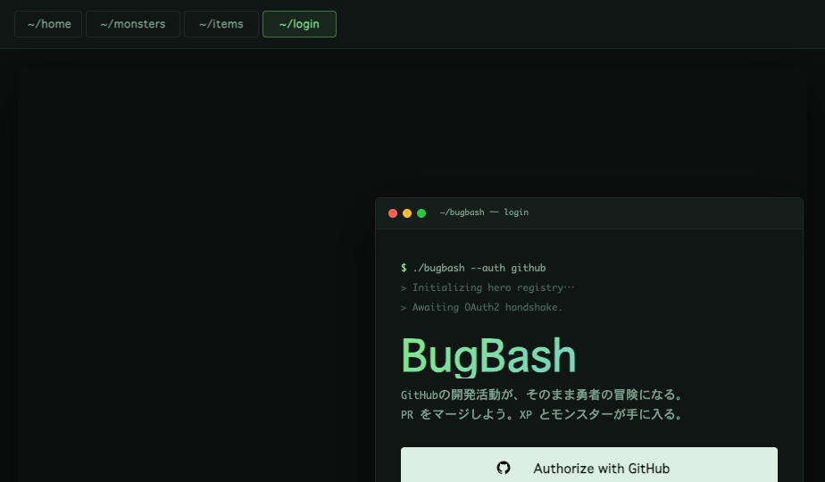
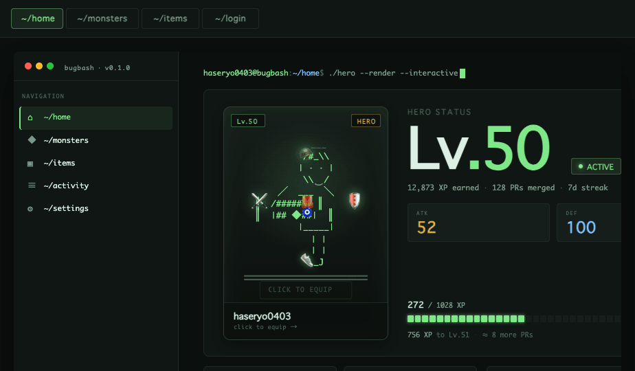
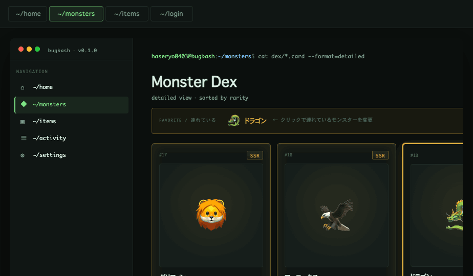
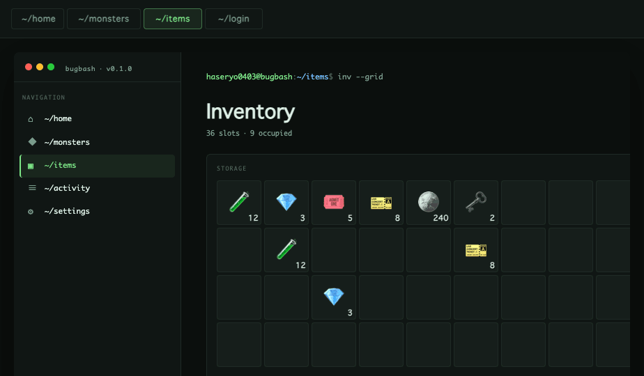

# Handoff: BugBash Frontend Redesign — Direction A "Console RPG"

## Overview

This is a redesign of the **BugBash** frontend (a gamified GitHub activity tracker — PRs merged → XP → monster catches → leveling up). The new direction reframes the entire app as a **terminal/devtool** aesthetic: developers' native habitat. Hero stats render like `git status` output, the activity feed reads like `git log`, the XP bar is a build-progress bar made of ASCII-style cells, and rarity tags look like terminal output chips.

The visual core: deep green-on-near-black (`#7ee787` on `#0b0f0d`), JetBrains Mono throughout, GitHub-dark-style chrome. The result feels closer to a CLI dashboard or VSCode extension panel than a typical RPG UI — which is the point. The audience is engineers; meet them where they live.

## Screens at a glance

| Login | Home |
|---|---|
|  |  |

| Monster Dex | Inventory |
|---|---|
|  |  |

For an interactive walk-through, open `preview.html` in a browser.

## About the Design Files

The HTML/JSX in `reference/` are **design references**, not production code to copy verbatim. They were written as a single-file React+Babel prototype to communicate intent — colors, type scales, layout proportions, content density, interaction surfaces.

Your task is to **recreate these designs inside the existing `bugbash-frontend` codebase** (Next.js 15 App Router + Tailwind v4 + TypeScript). Use the project's existing patterns:
- Hook-based data fetching (`useHero`, `useMonsters`, `useItems`, `useAuth`)
- `MainWrapper` + `SideBar` shell layout
- `'use client'` page components calling typed hooks
- Tailwind utility classes (no inline `style={}` objects in production — those are only in the reference for prototyping speed)

Don't import the reference JSX directly — read it, extract the visual decisions, and rebuild with Tailwind classes against the existing component shells.

## Fidelity

**High-fidelity.** Colors, type, spacing, and layout should be reproduced as specified. Component composition (which screens have which sections, in what order) is also fixed. What's flexible: micro-interactions, hover states, loading skeletons — use your judgment, keep the terminal vocabulary (caret blinks, monospace numbers, subtle glow on focus).

## Screens

### 1. Login (`/login`)
A standalone centered terminal-window card. No sidebar.

- **Layout**: viewport-centered, single 480px-wide "terminal window" card with traffic-light chrome (red/yellow/green dots), title "~/bugbash — login", and inner padding `32px 28px 28px`.
- **Top of card body**: 3 lines of dimmed mono prompt text (`$ ./bugbash --auth github` → `> Initializing hero registry…` → `> Awaiting OAuth2 handshake.`), `13px`, color `#7a9c8c`, line-height `1.7`.
- **Title**: "BugBash" at `48px / 700`, gradient fill `linear-gradient(135deg, #7ee787, #79c0ff)` clipped to text.
- **Subtitle copy** (Japanese): two lines explaining "your GitHub activity becomes your hero's adventure" — `14px`, `#7a9c8c`.
- **CTA**: full-width button, white background `#dcefe5`, dark text `#0b0f0d`, `14px / 600`, `4px` radius, GitHub mark icon (left) + "Authorize with GitHub". 14px vertical padding.
- **Footnote**: dimmed mono caption — `hero_id := github_id · permissions: read:user, repo`.
- **Hooks**: `useAuth().login()` on click.

### 2. Home (`/`)
The dashboard — **hero-centric** layout. Sidebar + main column. The hero is the centerpiece: a large interactive "holo card" on the left, level + stats on the right, equipment + activity beneath.

**Sidebar (240px)** — see "Sidebar" section below for the full spec; appears on every authed screen.

**Main column** — vertical stack with `28px 36px` outer padding:

1. **Command-prompt header** — single line at the top: `<username>@bugbash:~/home$ hero --stats` followed by a blinking block caret. Use color tokens: username = green (`--accent`), `~/home` = blue (`--accent-2`), `:` and `$` = `--text-faint`, command = `--text`.

2. **Hero hero row** — `grid-template-columns: 360px 1fr; gap: 24px`:

   - **Left: Hero holo card** (`360px` wide, `~480px` tall) — a large vertical "trading card" of the hero. Background is a soft radial holo gradient (purple → blue → green at 6% opacity over `--bg-elev-2`); `1px --line` border; `8px` radius. Top: rarity chip (`SSR`), absolute top-left, 8px inset. Center: hero render at `~280px`, drawn via the chosen `HeroStyle` (see "Hero render system" below). Bottom: a name plate (`bg-elev` strip, top-bordered, `12px 16px`): username (`14px / 600`) + `Lv.50 · SSR` micro-caption. The whole card is **clickable** → opens the Equipment modal. On hover: `transform: translateY(-2px)` + intensified holo glow.

   - **Right: Stat panel** (`bg-elev` card, `1px line` border, `6px` radius, `24px 28px` padding):
     - Top row: `ACTIVE` chip (green, with `●` blinking dot) on the left, `Lv` micro-label on the right.
     - **Display level**: `Lv` (green, 32px) `.50` (white, 96px) at `700`, JetBrains Mono, line-height 1. Beneath: `hero_id: 169417583 · github: @username` 12px in `--text-dim`.
     - **Stat trio** — `repeat(3, 1fr) gap:12px`. Each: micro-label (10px uppercase) + value (24px, accent color) + sublabel (11px dim).
       - `ATK` · `342` (green) · `total damage`
       - `DEF` · `218` (blue) · `mitigation`
       - `LUCK` · `87` (gold) · `SSR drop +`
     - **XP bar** at the bottom: header line `building Lv.51 … 272/1028` (left) + `26.5%` (green, right). 40-cell ASCII-style bar (flex row, each cell `flex:1; height:14px; border-radius:1px; gap:2px`). Filled = `--accent` + `0 0 6px --accent` glow; empty = `--bg-elev-2`. Caption beneath: `> ETA: 756 XP · ≈ 8 PRs`.

3. **Equipment row** (`bg-elev` card, full-width, `20px 24px` padding) — header `EQUIPMENT [6/6]` micro-label + `manage →` link. Body: `repeat(6, 1fr) gap:12px` of square slots, each `aspect-ratio: 1`, `bg-elev-2`, `1px line` border, `4px` radius. Each slot shows: slot label top-left (`HEAD / BODY / WEAPON / SHIELD / ACC1 / ACC2`, 9px `--text-faint`), centered emoji (`32px`), item name beneath (`10px / 600`), rarity chip top-right. Empty slot: dashed border, `−` glyph, `(empty)` label. Clicking any slot opens the Equipment modal scoped to that slot's compatible items.

4. **Bottom split row** — `grid-template-columns: 1fr 1fr; gap: 16px`:
   - **Active party card** — header `ACTIVE_PARTY [4]` micro-label + `edit →` link. Body: 4-column grid of square monster slots, each `aspect-ratio: 1`, `bg-elev-2`, `1px line` border. Inside: large emoji (`36px`), 10px name beneath, rarity chip absolutely positioned top-right (4px inset).
   - **Activity log card** — header `git log --activity` + `● 3 unread` (green). Body is a list of 5 rows, each `padding: 10px 16px`, separated by `1px line` dividers. Each row: 28×28px monster icon thumbnail (left), then a single-line message `+100 XP · caught <name> <rarity-chip> [LV UP if true]` followed by a second-line repo + PR + title in dim/blue, then 10px `--text-faint` timestamp.

#### Hero render system

The hero illustration inside the holo card is **pluggable** — `reference/hero-system.jsx` exposes 4 styles. Pick the one we ship (current default: `silhouette-svg`):

| Key | Description |
|---|---|
| `ascii` | ASCII-art figure, monospace, layered with equipment glyphs. Most CLI-native. |
| `dot-pixel` | 16-bit-style dot-pixel sprite drawn with CSS box-shadows or SVG `<rect>` grid. RPG-game feel. |
| `emoji-stack` | Single emoji body with equipment emojis floating around hand/head/body anchors. Quick to extend. |
| `silhouette-svg` | Inline-SVG silhouette (head/body/limbs paths) with equipment slots highlighted in accent green. Cleanest at large size. **Default**. |

Equipment hooked into each style: head/body/weapon/shield/acc anchors are computed from `BB_DATA.hero.equipment` and rendered as overlays.

#### Equipment modal

Clicking the hero card or any equipment slot opens a modal (`equip-modal.jsx`):
- Backdrop: full-screen `rgba(11,15,13,0.7)` + `backdrop-filter: blur(6px)`.
- Panel: centered, `~640px` wide, `bg-elev` + `1px --line` + `8px` radius. Header: `equip --slot=<slot>` mono prompt + close button (top-right `×`).
- Left column (`200px`): **slot tabs** stacked vertically — each row shows current item icon + slot label; active row has green left border. Clicking switches scope.
- Right column: **inventory list** — items filtered to that slot's `kind`. Each row: emoji + name + rarity chip + ATK/DEF deltas (green if upgrade, red if downgrade) + `equip` button. Currently equipped item gets a `● equipped` chip.
- Equipping mutates local state only (prototype). In production: call `useEquipment().equip(slot, itemId)`.
- Esc / backdrop click closes.

### 3. Monster Dex (`/monsters`)
Sidebar + main column. **TCG-style large card grid** (the "big card" variation — see `AMonsterCards` in `dirA-variants.jsx`).

- **Prompt header**: `<username>@bugbash:~/monsters$ ls --rarity --view=cards`.
- **Title row**: title "Monster Dex" at `28px / 600`. Subtitle: `discovered <n> / <total> · owned <n> instances`. On the right, filter chip group: `all | SSR | SR | R | N`.
- **Card grid** — `repeat(auto-fill, minmax(220px, 1fr)); gap: 16px`. Each card is a vertical TCG-style card (`~220 × 320px`):
  - Top: rarity chip pinned absolute top-right, `#<id>` micro-tag top-left.
  - Center: a large emoji art frame (`bg-elev-2` background, full-width, `~140px` tall, emoji at `64px`). SSR cards get an inset gold glow + holo gradient overlay; SR get a purple glow.
  - Bottom plate: name (`14px / 600`), `Lv.<requiredLevel>` micro-caption, then a small stat row (ATK/DEF if present) and `×<owned>` count chip.
  - Undiscovered cards: dashed border, `45%` opacity, `?` art, `???` name, no stats. Sorted to the end of their rarity group.
  - Hover: `translateY(-3px)` + intensified glow.
- **Section grouping**: cards are grouped by rarity (SSR → SR → R → N), each section preceded by a header row (rarity chip + count + 1px divider).
- **Click** a discovered card → opens a monster detail modal (defer to follow-up; placeholder OK in v1).

### 4. Items (`/items`)
Sidebar + main column. **Minecraft-style hotbar + grid inventory** (see `AItemsHotbar` in `dirA-variants.jsx`).

- **Prompt header**: `inv --list`.
- **Title**: "Inventory" at 28px. Subtitle: `<n> stacks · <total> items total`.
- **Hotbar** — single full-width row of **9 cells**, `bg-elev` card with thicker `2px line` border, `8px` radius, `12px` padding. Each cell: `aspect-ratio: 1`, `bg-elev-2`, `1px line` border, `4px` radius. Inside: emoji (`28px`), quantity in bottom-right corner (`11px / 700` with subtle text-shadow), slot index `1–9` in top-left corner (9px `--text-faint`). Active hotbar cell (selected): green border + green inset glow. Empty cell: dashed border, no content.
- **Inventory grid** — `repeat(9, 1fr); gap: 6px`, 3–4 rows. Same cell styling as hotbar but smaller (`aspect-ratio: 1`, no slot index). Empty cells stay rendered (dashed border) so the grid feels like a real Minecraft inventory.
- **Tooltip on hover**: name + kind + effect text in a small floating panel (`bg-elev`, `1px --line`, `8px` padding).
- **Click** an item → equip if equipable, else open detail.

## Sidebar (`240px`, persistent)

- Background `--bg-elev`, right border `1px --line`. Mono throughout.
- **Top "window chrome"**: 14px 16px padding, bottom-bordered. Three traffic-light dots (10px each, red `#ff5f56` / yellow `#ffbd2e` / green `#27c93f`) + caption `bugbash · v0.1.0` in 11px `--text-dim`.
- **Section label**: `Navigation` in 10px uppercase `--text-faint`, letter-spacing `0.12em`.
- **Nav items** (5): each row `8px 10px` padding, 4px radius, 13px text, with a leading 14px-wide glyph (`⌂ ◆ ▣ ≡ ⚙`). Active state: text in `--accent`, background `rgba(126,231,135,0.08)`, left border `2px solid --accent`.
  - `~/home` → `/`
  - `~/monsters` → `/monsters`
  - `~/items` → `/items`
  - `~/activity` → `/activity` (new — see "What's new")
  - `~/settings` → `/settings`
- **Hero summary footer** (auto-margined to bottom, 12px padding, `bg-elev-2`, top border): micro-label `HERO_STATUS`. Below: 32×32 gradient avatar tile (`linear-gradient(135deg, --accent, --accent-2)`, white "H" at 14/700) + username (12px) + `Lv.<n>` (10px dim). Then a 4px height mini XP bar with the same gradient, filled to `progressRatio`.

## Sidebar (login screen)

The login screen does NOT show the sidebar. It's a centered standalone terminal-window card.

## Design Tokens

```css
/* Direction A — Console RPG */
--bg:           #0b0f0d;   /* page bg */
--bg-elev:      #101614;   /* cards, sidebar */
--bg-elev-2:    #161e1b;   /* nested cards, sidebar footer */
--line:         #1f2a26;   /* hairlines, borders */
--line-strong:  #2d3d37;   /* divider on hover */

--text:         #dcefe5;   /* primary */
--text-dim:     #7a9c8c;   /* secondary */
--text-faint:   #4a6157;   /* tertiary, captions */

--accent:       #7ee787;   /* primary green — links, active, success */
--accent-dim:   #3da55a;
--accent-2:     #79c0ff;   /* blue — paths, secondary action */
--purple:       #d2a8ff;
--gold:         #e3b341;   /* SSR, XP totals */
--pink:         #ff7b72;
```

### Rarity colors (for chips)
- `N`   — `#7a9c8c` text, `rgba(122,156,140,0.1)` bg, `rgba(122,156,140,0.3)` border
- `R`   — `#79c0ff` text, `rgba(121,192,255,0.1)` bg, `rgba(121,192,255,0.3)` border
- `SR`  — `#d2a8ff` text, `rgba(210,168,255,0.1)` bg, `rgba(210,168,255,0.35)` border
- `SSR` — `#e3b341` text, `rgba(227,179,65,0.12)` bg, `rgba(227,179,65,0.4)` border

### Type scale
All UI uses **JetBrains Mono** (400/500/600/700). No serif, no system sans on UI surfaces.
- Display level number: `72px / 700 / line-height 1`
- Section title: `28px / 600`
- Card title: `14px / 600`
- Body: `13px / 400`
- Caption / micro-label: `10–11px / 600`, uppercase, letter-spacing `0.10em–0.12em`

### Spacing
Round multiples of 4. Card outer padding `24px 28px` (hero block) or `14px 16px` (stat tiles). Page padding `28px 36px`. Grid gaps `8 / 10 / 12 / 16` depending on density.

### Border radius
- Cards / panels: `6px`
- Buttons / chips: `4px`
- Inline tags / pills: `3px`

### Shadows
Mostly avoid. Use subtle inner glows on active/SSR (`box-shadow: inset 0 0 12px rgba(227,179,65,0.25)` for the SSR ring). Login card gets `0 20px 60px rgba(0,0,0,0.5)`.

## Components to add / modify

The existing codebase has:
- `src/components/SideBar.tsx` — needs **a full rewrite** to match the Console RPG sidebar above
- `src/components/UserProfile.tsx` — currently shows a green-bg user card; replace with the sidebar footer block (gradient avatar tile + username + Lv + mini XP bar)
- `src/app/components/HeroCard.tsx` — replace with the **Hero holo card + Stat panel** two-column composition
- `src/app/components/HeroParty.tsx` — replace with the **Active party card** spec (4 square slots with rarity chip top-right)
- `src/components/MonsterBoxCard.tsx`, `ItemBoxCard.tsx` — these are currently sidebar-link-cards; under this redesign sidebar links are simple anchor rows, so these components likely go away (or get repurposed for the inline grid cells in the dex/items pages — see `MonsterCell` / `ItemRow` below).

New components to create:
- `<PromptHeader path="~/monsters" command="ls --rarity" />` — the green/blue prompt line at the top of each main page.
- `<RarityChip rarity="SSR" />` — uses the rarity color tokens.
- `<StatTile label value sub color />` — for stat trios and dashboard grids.
- `<ProgressBarASCII ratio={0.265} cells={40} />` — flex row of `cells` divs colored by ratio.
- `<HeroHoloCard hero size onClick />` — the large clickable hero card (left side of Home).
- `<HeroRender style hero size />` — pluggable hero illustration (ASCII / dot-pixel / emoji-stack / silhouette-svg). See `reference/hero-system.jsx`.
- `<EquipmentRow equipment onSlotClick />` — 6-slot horizontal grid of equipment tiles.
- `<EquipmentSlot slot item onClick />` — single equipment tile (shared by EquipmentRow and the modal).
- `<EquipmentModal openSlot onClose onEquip />` — modal for swapping equipment. See `reference/equip-modal.jsx`.
- `<ActivityRow activity={...} />` — for the activity log.
- `<MonsterCard monster />` — TCG-style large card (Monster Dex page). See `AMonsterCards` in `reference/dirA-variants.jsx`.
- `<ItemHotbarCell item index />` + `<ItemGridCell item />` — Minecraft-style inventory cells. See `AItemsHotbar`.

## Interactions & Behavior

- **Caret blink** on the prompt header — pure CSS keyframe, 1s steps(2) infinite, only on the home screen.
- **Sidebar nav active state** is driven by `usePathname()` from `next/navigation` (existing pattern).
- **Filter chips on Monster Dex** — clicking a rarity filter narrows the dex to that rarity's section only. Default = "all" shows all four sections stacked.
- **Loading**: while hooks are fetching, render skeleton blocks with `bg-elev-2` background and a subtle `1.5s ease-in-out infinite` opacity pulse — keep it monochrome, don't shimmer.
- **Hover** on nav links and cards: lighten the background by ~4% (use `--bg-elev-2`), don't move or scale.
- **Click** on a monster cell → opens a modal with full monster details (defer to follow-up; placeholder OK in v1).
- **Authorize button** on login: calls `useAuth().login()`. While redirecting, swap the button label to `> connecting…` with the same blink caret.

## State Management

Existing hooks are sufficient — no new state shape required:
- `useAuth()` — login/logout/status
- `useHero()` — returns `{level, totalExperience, currentLevelExperience, experienceForNextLevel, experienceToNextLevel, progressRatio}`
- `useMonsters()` — returns owned monster list
- `useItems()` — returns inventory

What changes is the **derived data** the screens need. Add small selector helpers (or `useMemo`) for:
- `dexEntries`: merge a static species master list with owned counts → `{id, name, emoji, rarity, requiredLevel, owned, discovered}`
- `discoveredCount` / `totalCount` / `ownedTotal`
- Group dex entries by rarity for the dex page

Master species list should live alongside the types — see `reference/mock-data.js` for a working 20-species master matching the Phase 1 spec (`N:3, R:6, SR:7, SSR:4`). Confirm the canonical list with backend before shipping; the mock list is a placeholder.

## What's new vs. the current frontend

- **Activity feed page (`/activity`)** — implied by sidebar nav and surfaced on Home. Backend exposes `GET /api/v1/hero/activities` per `docs/design.md`; the current frontend doesn't display it. Add `useActivities()` hook and an Activity page that's basically the activity log card from the home screen, full-width and paginated.
- **Hero stat grid** — adds top-line stats (PRs merged, SSR rate, streak) that aren't in the current UI. PRs-merged is derivable from activities; SSR rate and streak need backend support — confirm before shipping or hide tiles until available.
- **Filter chips** on the dex.
- **Rarity-grouped dex** — current frontend lists owned monsters in a flat grid; new design shows the **full dex** with placeholders for undiscovered species, grouped by rarity.

## Files in this handoff

```
design_handoff_console_rpg/
├── README.md                   ← this file
├── preview.html                ← open in browser to see Direction A in isolation
├── screenshots/                ← reference screenshots of each screen
└── reference/
    ├── dirA.jsx                ← Sidebar + Login + Hero-centric Home (AHomeScreen2) + ADirection shell
    ├── dirA-variants.jsx       ← AMonsterCards (TCG dex grid) + AItemsHotbar (Minecraft-style inventory)
    ├── hero-system.jsx         ← 4 hero render styles (ascii / dot-pixel / emoji-stack / silhouette-svg)
    ├── equip-modal.jsx         ← Equipment modal + ClickableHero wrapper
    └── mock-data.js            ← mock data + derived selectors matching the API shape
```

Open `preview.html` in a browser to interact with the four screens. Tabs at the top switch between Home / Monsters / Items / Login.

## Suggested implementation order

1. Drop in the design tokens as Tailwind theme extensions (or CSS vars in `globals.css`).
2. Wire up JetBrains Mono in `layout.tsx` (replace Geist).
3. Rewrite `SideBar.tsx` to match the new sidebar spec.
4. Build the small reusable primitives: `PromptHeader`, `RarityChip`, `StatTile`, `ProgressBarASCII`, `Slot` (square equipment/party tile).
5. Build the **hero render system** — pick one style from `hero-system.jsx` and port it to a `<HeroRender style={...} hero={...} size={...} />` component. Default to `silhouette-svg`.
6. Build the **Equipment modal** (`<EquipmentModal slot={...} onClose />`) backed by `useEquipment()`.
7. Rebuild `/` — hero holo card (left) + stat panel (right) + equipment row + party + activity feed.
8. Rebuild `/monsters` (rarity-grouped dex with filter chips — see `AMonsterCards` in `dirA-variants.jsx` for the TCG-style card layout).
9. Rebuild `/items` (Minecraft-style hotbar + grid — see `AItemsHotbar`).
10. Rebuild `/login` (centered terminal-window card).
11. Add `/activity` page using the existing `GET /api/v1/hero/activities` endpoint.

## Notes for the implementer

- **Do not introduce a UI library** (shadcn, Radix, MUI) just to ship this. Hand-rolled divs + Tailwind utilities are appropriate — the design vocabulary is small (cards, chips, rows, progress bars) and the visual specificity is high.
- **Avoid emoji-only icons in nav and chrome.** The reference uses unicode glyphs (`⌂ ◆ ▣ ≡ ⚙ ●`) intentionally — they fit the terminal aesthetic better than colorful emoji. Monster emojis stay (they're content, not chrome).
- **Don't add gradients beyond what's specified** (the Lv title gradient on login, the avatar tile, the XP mini-bar). Console RPG is restrained — flat green-on-black is the brand.
- **Numbers should be tabular** — apply `font-variant-numeric: tabular-nums` everywhere a number renders (XP totals, levels, percentages, counts) to keep them rock-steady.
