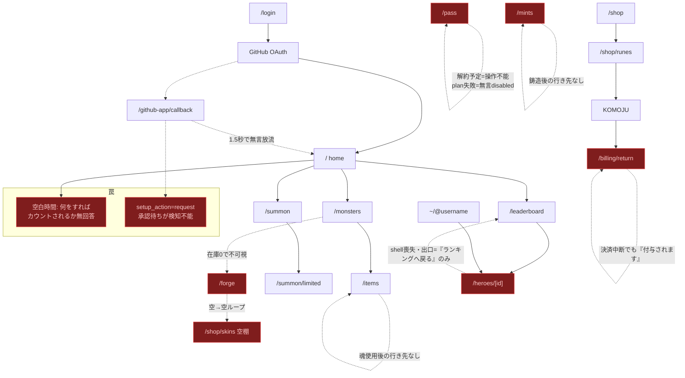
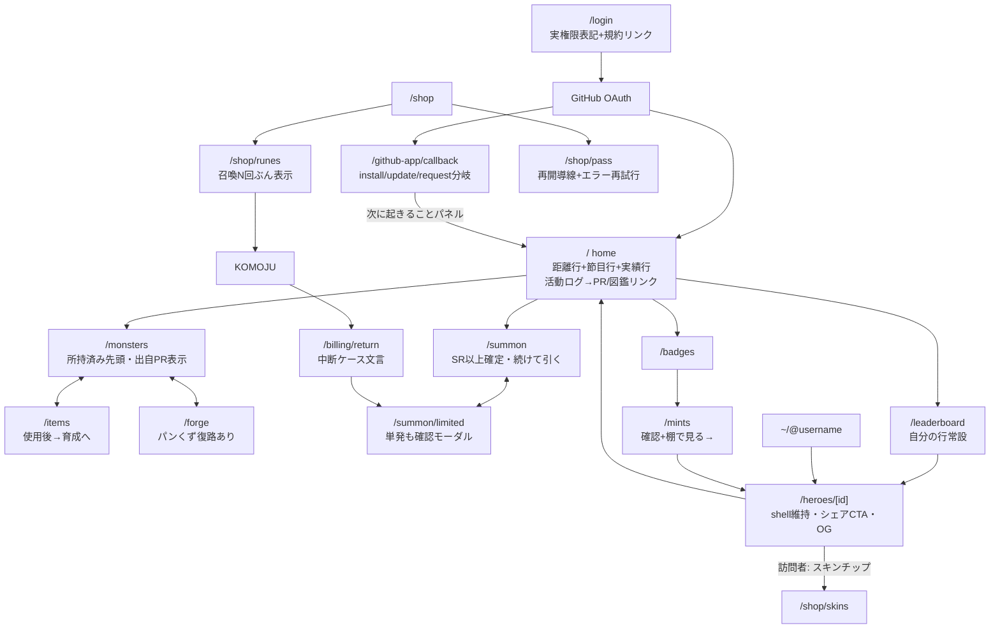

# BugBash UX再設計ブループリント（2026-08-06）

> 「UXが悪い」への体系的回答。7視点の専門監査（onboarding / navigation / collection / summon / commerce / social / bar-raiser）を統合・重複排除・矛盾解決したもの。file:line は `src/` 起点、対象コミットは main `335b5f2`。
> 先行文書（UX-DESIGN / UX-IMPROVEMENT-PLAN / REVENUE-ANALYSIS / PRE-RELEASE-ANALYSIS）の指摘は再掲せず、その先を掘っている。実装の進捗は §6 の各項目に追記していく。

---

## 1. 診断の要約 — 「UXが悪い」の正体

症状は各画面に散らばっているが、根本原因は5つに圧縮できる。

### 原因1: 初動の3連続取り零し（信頼→文脈→行動の順に落とす）
/login の過大スコープ表示（`repo` = 実態と異なる最重量権限、login/page.tsx:93）→ /github-app/callback の無言放流（setup_action 無視・1.5秒で `/` へ、callback/page.tsx:16-36）→ 導入後〜初マージまでの空白時間に「何をすればカウントされるか」を答える画面が存在しない。課金以前に**初動の生存率**が漏斗の最上流を狭めている。FTUE の home では「導入せよ」が3箇所に重複する一方、主役CTAは12pxで飾りの Lv.1 が80px という階層逆転も同根。

### 原因2: 目標の階段が「初日」と「無限」しかない
FirstQuestChecklist は完了で消え（FirstQuestChecklist.tsx:58）、NextActionStrip は残高≥コストの時しか行を出さない（nextAction.ts:44-50）。**残高不足＝画面から目標が消滅**。週次概念はコードベースに存在せず、home は図鑑・バッジ・Lv の「次の節目まであとN」を一切示さない。マージが無い日に開くと押せるものがゼロになり、「BugBashは結果の確認先」という仮説を自己成就させている。

### 原因3: 「操作の隣に真実」の自己規律が未徹底
自ら定めた原則（UX-DESIGN.md 原則6・D2）への違反が横断的に残る。最重度は (a) 通常召喚天井の「SSR確定」表記 — 実態は SR以上保証（GachaSampler.kt:27）で**約束違反**、(b) 進化/路線変更の事前開示ゼロ（消費アイテム・50/50ランダム性・確認モーダルなし、EvolveMonsterUseCase.kt:23-29）、(c) コイン由来アイテムへの琥珀💎誤ラベル（items/page.tsx:24-26）。さらに操作結果の表示位置（monsters 上部）、使用後の次の一歩欠落（items・mints・badges）、生enum露出（DisclosureModal.tsx:122）が同型の断線。

### 原因4: 社会面は「中身はあるが見せる手段がない」＋シェル喪失
トロフィールームの中身（スキン・APEX・プレート）は誠実に作れているが、シェアCTAゼロ・OGゼロ・URLが数値ID。さらに `/heroes/[heroId]` は shell 外でサイドバーが消え、**最も支払い意欲が高い瞬間（自慢を眺めた直後）にナビが不在**。leaderboard のエラー偽装空状態（page.tsx:25 で error を捨てる）と存在しない heroId の骨ページという「嘘の状態」2つが観客ループの入口を塞ぐ。

### 原因5: 例外状態に置かれた「払う気のあるユーザー」の放置
解約予定→再加入不能（subscriptionPass.ts:145-154）、plan取得失敗→無言の恒久disabled（pass/page.tsx:63）、決済中断→「付与されます」誤表示（returnPolling.ts:27-31）、org承認待ち→「未導入」表示のまま、スキン空タブへの常設誘導。**幹の導線は設計文書に忠実で健全。損失は例外パスに集中している。**

---

## 2. 情報設計の再定義

### 現状 → 提案（サイドバーは6項目上限を維持）

| 現状 | 提案 | 所属理由 |
|---|---|---|
| ◆ ~/home | ◆ ~/home「ホーム」 | 結果確認＋次の一手の起点。変更なし、日本語サブラベル追加のみ |
| ~/@username（shell外へ抜ける） | ~/@username「プロフィール」（**shell内で表示**） | ナビ6項目中これだけシェルを失う倒錯を解消。isSelf 時は AppShell 維持 |
| ≡ ~/monsters | ≡ ~/monsters「図鑑・育成」 | /items・**/forge** をここに帰属（navConfig.ts:61 の `/forge:"/shop"` を `"/monsters"` へ）。工房は「買う」でなく「育てる」文脈 |
| ▲ ~/summon | ▲ ~/summon「召喚」 | /summon/limited を含む。変更なし |
| ▲ ~/leaderboard | ▲ ~/leaderboard「ランキング」 | 変更なし |
| $ ~/shop（琥珀） | $ ~/shop「ショップ」（琥珀） | **/pass を /shop/pass へ移設**（旧URLはredirect）。タブ分類とURL階層の乖離解消 |
| HERO_STATUS（開閉不明瞭） | HERO_STATUS ⛭（▸/▾キャレット） | ログアウト・課金設定・法的表示の到達率改善 |

- **英語コマンド美学は維持**し、`jaLabel` 併記（navConfig.ts:20-25 拡張、SideBar.tsx:49 で 10px faint 表示）で初見の解読コストだけ消す。
- /badges への入口を**単線（プロフィールのみ）→2本**に: home に実績進捗1行（「pr_slayer あと3PRでTier 2」）を追加。
- /mints はサイドバー非掲載を維持（設計通り）。ただし完了後にプロフィール棚への出口を付ける。
- モバイルは ☰ を ConsoleTopbar 左端へ統合し AppShell の☰ストリップ（AppShell.tsx:30-40）を削除、二段約100px→一段54pxへ。

---

## 3. 画面遷移図

### (a) 現状の主要フロー（赤系＝行き止まり・罠）

### (b) 提案フロー

---

## 4. セッションの型 — 「開いて30秒」の設計

home を状態機械として定義し、**どの状態でも必ず1つは押せるものがある**ことを保証する（非搾取＝期限なし・失効なし・全て事実開示）。

| 状態 | 30秒で起きること | 実装 |
|---|---|---|
| 未読報酬あり | 儀式（RewardModal）→ NEW個体へ図鑑リンク | 実装済み・維持 |
| 残高≥召喚コスト | READY行 → 2クリックで召喚 | 実装済み・維持 |
| **残高<コスト** | 「召喚まであと N コイン（PR約M件）」距離行 | nextAction.ts:39-51 の `null` を距離行に変更 |
| **何も無い日** | 「次の節目」1行（次に埋まる図鑑1体 / バッジ次Tier / 次Lv） | 新規 `NextMilestoneStrip`（既存 `buildDexProgress`＋`useBadges` データのみ） |
| 任意 | 「今月の目標を自分で決める」自己設定行（達成表示のみ・報酬なし） | 上記ストリップ第4行として Wave 2 |

**日次で戻る理由** = マージの結果確認（既存の山）＋距離の1目盛前進の可視化。**週次で戻る理由** = 節目到達（図鑑1体・バッジTier・Lv節目）と月間発見数のランキング窓（Wave 3）。ログインボーナス・時限クエスト・FOMOタイマーは採用しない — 報酬の起点は常に開発活動（マージ）に置く。RewardModal は誤クリック消失を防ぐため CLAIM/次の一歩のみを既読トリガーにし、2回目以降の着信は非モーダルチップに降格（割込み事故の防止、Wave 2）。

---

## 5. 画面別の変更指示書

矛盾解決の方針: ユーザー影響順。演出は「サーバ確定済み事実の見せ方」の範囲でのみ強化（嘘の盛りは不採用）。

### /login（login/page.tsx）
| 変更 | 指示 | 効果/工数 |
|---|---|---|
| スコープ表記修正 | :92-94 の `repo` 表記を実権限に修正＋「リポジトリの選択はインストール時に行えます」 | 中/S |
| 規約リンク | カード下に legalFooterLinks を並記（現状ログイン前に規約到達不能） | 中/S |
| 製品3ステップ図 | 「PRマージ→XP→モンスター」をテキスト図で | 中/M |

### /github-app/callback（callback/page.tsx）
| 変更 | 指示 | 効果/工数 |
|---|---|---|
| setup_action分岐 | :16-19 に `update`=「リポジトリ設定を更新」/ `request`=「組織管理者の承認待ちです」を追加 | 大/S |
| 完了パネル化 | :34-36 の即時遷移を廃し「次に起きること」（TrackingReadyPanel と同文）＋「ホームへ」ボタンに | 大/S |
| エラー再試行 | :64-73 に再試行ボタン | 小/S |

### / home（(authed)/page.tsx）
| 変更 | 指示 | 効果/工数 |
|---|---|---|
| TrackingReadyPanel 新設 | `hasGithubAppInstalled && totalPrsMerged===0` 時に :187 直下へ。「あなたが author の PR がマージされると数秒で反映。過去分は対象外」＋リポジトリ追加リンク（:168-181を吸収）＋コイン減衰則の開示。Checklist step2（FirstQuestChecklist.tsx:43-46）にアンカー付与 | 大/S |
| 活動ログのリンク化 | :402-407 のメタ行を PR への外部 `<a>` に、モンスター名→/monsters。6件超過時「すべて表示」展開＋「直近6/全N」表記（:348,:360） | 大/S |
| 距離行＋節目行 | §4 の通り（nextAction.ts 拡張＋NextMilestoneStrip 新設） | 大/S |
| 実績進捗1行 | 「{badge} あと N で Tier X」→ /badges（単線解消） | 大/M |
| 表示の正直化 | :278-281「monsters caught」→「species owned」、:245 に `flex-wrap`、SideBar.tsx:213 の progressRatio ガード | 小/S |
| プレート棚を活動ログの下へ | :332-342 を移動 | 小/S |

### シェル（AppShell / ConsoleTopbar / SideBar / MobileNavDrawer）
| 変更 | 指示 | 効果/工数 |
|---|---|---|
| モバイル一段化 | drawerOpen を Context 化し ☰ を ConsoleTopbar 左端へ、AppShell.tsx:30-40 削除。コマンド文字列は `hidden md:inline` | 大/M |
| jaLabel | navConfig.ts:20-25 に追加、SideBar.tsx:49 で併記 | 中/S |
| ドロワー | パネル内 ✕＋フォーカストラップ（MobileNavDrawer.tsx:53-59） | 中/S |
| ルーン残高チップのリンク化 | ConsoleTopbar.tsx:43-46 → 開催中は /summon/limited、平時は /mypage/billing | 中/S |
| SECTION_OF | navConfig.ts:61 `/forge` → `/monsters` | 小/S |

### /monsters（monsters/page.tsx）
| 変更 | 指示 | 効果/工数 |
|---|---|---|
| 進化・路線変更の確認モーダル | `EvolveConfirmModal` 新設（BadgeCosmeticConfirmModal 踏襲）。消費アイテム・残数・**覚醒/暴走50/50のランダム性**・路線変更コストを事前開示（:577-595） | 大/M |
| 結果表示のカード内化 | :312-321 を廃し InlineActionResult を MonsterCard 内へ | 大/S |
| 並び順反転 | 所持済み→NEW→未所持、グループ N→SSR（:35,:146）。ヘッダに進捗バー＋「次に埋まりやすい枠」 | 中/S |
| 出自PR表示 | BE: AcquisitionInfo を owned monster API に同梱 → `types/monster.ts` に `acquisition?` 追加、カードに1行「#123 fix-auth より」 | 大/M(BE小) |
| Lv不足の理由表示 | disabled 時「fire魂 あとN → 入手先」1行 | 中/S |
| パートナー変更の分離 | 全面クリック（:422）廃止、★ボタン化 | 中/S |

### /items（items/page.tsx）
| 変更 | 指示 | 効果/工数 |
|---|---|---|
| 💎誤ラベル撤去 | :24-27 の category ベース判定を廃止（BEに購入通貨フラグが立つまで💎表記自体を撤去）。ヘッダ注記 :120-124 も削除 | 中/S |
| 使用後の次の一歩 | useResult（:245-260）に「相棒のレベルアップへ → /monsters」 | 大/S |
| ホットバー廃止 | :172-180 を削除し STORAGE 一本化（1行目の複製＝嘘のアフォーダンス。「実機能を与える」案は需要未実証のため不採用） | 中/S |
| SELECTED の可視 | `xl:`→`lg:`、モバイルはボトムシート。COLS を モバイル6 に | 中/M |

### /summon・/summon/limited
| 変更 | 指示 | 効果/工数 |
|---|---|---|
| **「SSR確定」誤記修正** | summonPity.ts:114-118 に `guaranteeType` を渡し「SR以上確定」/「目玉SSR確定」を出し分け（BE実態: GetSummonDisclosureUseCase.kt:98）。テスト更新 | 大/S |
| ソフト天井の説明 | PityMeter.tsx:85-89 に「60回目からSR以上が出やすくなります」（GachaSampler.kt:49-63 準拠） | 大/S |
| Disclosure 和訳・丸め | 生enum（SR_OR_ABOVE / UNLIMITED / GUILD_COIN / 生ID）を辞書経由に、% は小数2桁丸め（disclosure.ts:16-23,57-59、DisclosureModal.tsx:122） | 大/S |
| 結果に天井残数 | 「pity: 3 pulls」→「天井まであと77回」（buildPityMeterPresentation 再利用） | 大/S |
| 限定単発の確認モーダル | limited/page.tsx:287 を LimitedPullConfirmModal(pullCount:1) 経由に | 中/S |
| 10連の正直コピー | 「10連の割引はありません（300=30×10）」を両画面コスト行に | 中/S |
| 結果演出の共通化 | `SummonResultGrid` 新設（名前表示・SR以上サマリ行・SSR枠強調・レア別リビール）。通常側にも「続けて引く」、grid-cols-2 sm:grid-cols-5 統一、◈/🪙統一、「左の」削除、開示APIエラー帯を通常側にも | 大/M |
| 限定バナーに目玉表示 | LimitedSummonBanner に getFeaturedLimitedItem＋ItemVisual | 大/S |
| 通常結果の育成接続 | 「＝◯◯があとNでLv UP」を添える（monsterProgression.ts で算出） | 中/S |

### /shop 系・/pass・/billing/return・/mypage/billing・/mints
| 変更 | 指示 | 効果/工数 |
|---|---|---|
| /pass: plan エラー再試行 | pass/page.tsx:63 で error を受け、:215-226 型のバナー＋再読込 | 大/S |
| /pass: 解約予定の受け皿 | 短期: 「期間末後に再加入できます」説明文。恒久: BE un-cancel API＋「更新を再開する」 | 大/S→L |
| 解約文言統一 | `CancelPassModal` 共通化（/pass:474 と mypage:454 の語感差解消） | 中/S |
| runes: 召喚回数換算 | BE rune products に `limitedSingleCostRune` 同梱 → カード・確認モーダル・billing/return CTA に「限定召喚 約N回ぶん」。最安単価バッジも | 大/M |
| 確認モーダルに残高→購入後残高 | shop/page.tsx:168 直下に2行追加 | 中/S |
| billing/return: 中断ケース | returnPolling.ts:27-31 の timeout 文言に中断併記＋「もう一度購入する」 | 中/S |
| mypage: 月間支出と上限の常設 | BE 上限/当月消化額 API → WALLET 区画＋runes ページに常設（一過性 state バナーの恒久化） | 大/M |
| mypage: SKU 可読化＋パス請求統合、退会時の有償ルーン内訳表示（:46-51 受信済み） | | 中/M・小/S |
| /mints: 確認ステップ＋完了導線 | :228 の即POSTに確認（200ルーン・残高→購入後）を挟み、成功時 InlineActionResult＋「プロフィールの棚で見る →」。未達成選択時は条件表示 | 中/S |
| /shop/skins 空状態 | 0件時 ConsoleEmptyState（→/monsters）、復刻カレンダーは `skins.length>0` 時のみ。ShopTabs に「準備中」注記 | 中/S-M |
| /forge パンくず | `?skin=` 到達時「← スキン詳細へ」復路 | 中/S |

### /leaderboard・/heroes/[heroId]・/legal
| 変更 | 指示 | 効果/工数 |
|---|---|---|
| 嘘の空状態修正 | leaderboard/page.tsx:25 で error 受領→エラー分岐。heroes/page.tsx:161-164 で `unavailable` → not-found 表示 | 大/S |
| 自分の shell 維持 | isSelf 時は AppShell 相当で表示。最低限 :184-189 を「アプリへ戻る」に、:341 の来訪者CTAを `!isSelf` 限定 | 大/M |
| シェアCTA | isSelf 時「リンクをコピー」（ShareProfileButton 新設） | 大/S |
| OG/メタデータ | `heroes/[heroId]/layout.tsx` 新設で generateMetadata＋opengraph-image | 大/M |
| 訪問者ヘッダ | 未ログイン時「BugBashとは / ログイン」に差替。スキンチップ→/shop/skins?monster= リンク化（在庫投入後） | 中/S・大/S |
| 自分の順位常設 | BE `/api/leaderboard/me` → 圏外時に「…」区切りで自分行。凡例1行（上位100・60秒更新・週末スキップ）。行全体 Link 化、上位3行の表彰台化 | 大/M |
| legal | 各ページ metadata 追加、バッジ gold→blue、購入導線隣のリンクに「（準備中）」明示。**文言確定は販売開始のブロッカーとして事業側へエスカレーション** | 中/S |

---

## 6. 実装ウェーブ

> **進捗（2026-08-07）**: Wave 1 = 全項目 ✅（FE #163）。Wave 2 = FE完結分 ✅（FE #164）＋BE小依存分 ✅（BE #323 / FE #165）。未了は「今月の目標」自己設定行・/pass→/shop/pass 移設・バッジスロットピッカーのみ。Wave 3 は /me API・出自PR・runes換算が前倒しで ✅、パス un-cancel は**取り下げ**（解約時に KOMOJU 側サブスクリプションを削除済みで、フラグだけ戻す resume は「更新される」と表示しながら課金・更新が走らない嘘になるため。再開は期間終了後の再加入に一本化）。残りは下記の注記どおり。

### Wave 1 — FEのみ・即効（これだけで体感が変わる10項目） ✅ 完了（#163）
1. callback の setup_action 分岐＋完了パネル化（初動の無言放流を止める）
2. TrackingReadyPanel（空白時間に答えを置く）
3. home 活動ログのリンク化＋全件展開＋表示の正直化
4. 召喚の正直さ一式: 「SR以上確定」出し分け・ソフト天井説明・Disclosure和訳/丸め・「天井まであとN回」
5. 進化・路線変更の確認モーダル（倫理規律への最重度抵触の解消）
6. NextActionStrip 距離行＋NextMilestoneStrip（残高ゼロでも目標が消えない）
7. 図鑑の並び順反転＋操作結果のカード内化
8. items: 使用後→育成リンク＋💎誤ラベル撤去＋ホットバー廃止
9. /pass: plan エラー再試行＋解約予定の説明文＋解約文言統一
10. 嘘の状態の一掃: leaderboard エラー分岐・profile unavailable 分岐・billing/return 中断文言・/login 権限表記＋規約リンク

### Wave 2 — FE大きめ or BE小依存 ✅ ほぼ完了（#164 / #165、残: 自己設定行・/pass移設・スロットピッカー）
- モバイル二段バー統合／jaLabel／ドロワー改善／ルーン残高チップのリンク化
- プロフィール: isSelf の shell 維持・シェアCTA・OG layout・訪問者ヘッダ
- 召喚: SummonResultGrid 共通化＋レア別リビール・限定単発確認・限定バナー目玉表示・育成接続
- 図鑑: ✅ 出自PR表示（BE #323: activities との一括結合で露出 / FE #165）
- コマース: ✅ runes 召喚回数換算（#323/#165）・確認モーダル残高2行・mints 確認＋完了導線・skins 空状態（#164）
- home 実績進捗行（/badges 第二入口）・「今月の目標を自分で決める」・RewardModal の既読トリガー限定＋着信チップ降格
- /pass→/shop/pass 移設・forge パンくず・バッジスロットピッカー

### Wave 3 — BE/事業判断依存（△ = 一部前倒しで完了）
- 購入上限・当月消化額の公開API＋mypage/runes 常設表示
- ~~パス un-cancel API~~ **取り下げ**（PSP側解約済みのため課金上の嘘になる。BE #323 参照）／orders の displayName・パス請求統合
- leaderboard: ✅ /me API＋自分行（#323/#165）。期間窓（今月の発見数軸）は未了
- installation リポジトリ一覧 API（TrackingReadyPanel の「追跡中: Nリポジトリ」）・承認待ち状態のバナー変種
- `/heroes/[login]` への正規化（シェアURL・OG・自己同一性を同時解決）
- **スキン在庫投入**（/forge・図鑑スキン棚・観客→顧客導線すべての前提。FE側の受け皿は Wave 1-2 で先に完成させる）
- 法定文言の確定掲載（販売開始の前提条件）

---

## 7. やらないことリスト

| 落とした提案 | 理由 |
|---|---|
| ログインボーナス・デイリークエスト（時限） | 報酬起点は開発活動に置く方針（UX-DESIGN.md）。翻訳不要と判断（bar-raiser と一致） |
| 限定召喚の残り時間表示・FOMO演出・疑似リーチ | 非搾取方針の中核。演出強化はサーバ確定済み事実の見せ方（レア別リビール等）に限定 |
| ホットバーへの「実機能付与」案 | 廃止を採択。需要未実証の機能追加より嘘のアフォーダンス除去が先 |
| バッジ工房の /forge タブ統合（工数L） | 情報設計の安定（SECTION_OF 修正・home 進捗行）を先行。スキン在庫投入後に再評価 |
| home への常設販促・課金バナー | 「home は売り場ではない」（UX-DESIGN.md §4.5）を維持。導線は topbar「+」と READY/距離行で足りる |
| 順位・XP の販売、リーダーボード煽り通知 | MONETIZATION §1.2 の名声/課金分離。期間窓の「追加」に留める |
| forge の `?from=` 分岐点灯 | SECTION_OF 一本化（/monsters）で十分。複雑化に見合う利得なし |
| リテンション目的の創作通知 | マージ発生の事実通知1本（REVENUE-ANALYSIS P2-7）のみ許容 |
| 10連割引の導入 | 「割引なし」の明示で解決。価格構造の変更は事業判断であり UX 側から要求しない |
| サイドバー7項目化（/badges 等の昇格） | 6項目上限の規律を維持。入口は home 進捗行とプロフィールの2本で解消 |

---

**総括**: 幹の設計（demand-first、値の非捏造、圏の分離）は業界水準を超えて誠実。直すべきは (1) 初動3連続の取り零し、(2) 目標の中段、(3) 自己規律の未徹底箇所、(4) 見せる手段、(5) 例外状態 — いずれも非搾取方針と衝突せずに埋まる。Wave 1 の10項目はすべて FE 単独・新規BEなしで着手可能。
