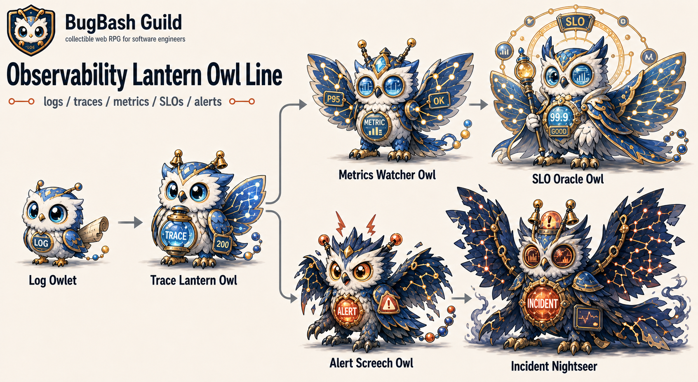
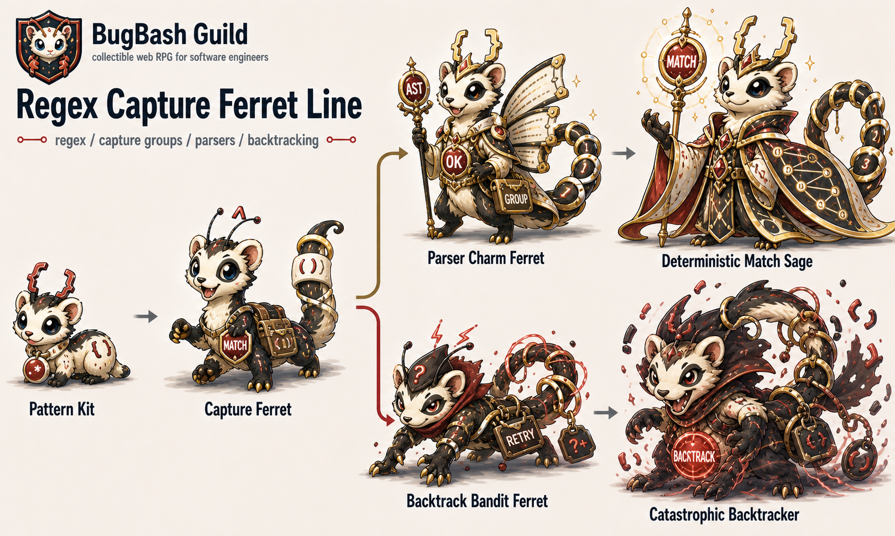
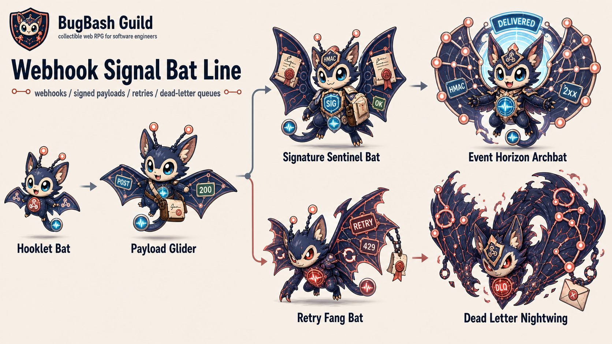

# Monster Visual References

BugBash Guild のモンスター画像生成で、文章プロンプトだけでは絵柄がぶれる場合に見る参照シート。
新しいチャットでモンスターを生成する前に、`docs/monster-style-guide.md` とあわせてこの3枚を確認する。

## 参照シート

### Observability Lantern Owl Line

見るポイント:

- 大きな目、丸い顔、やわらかい羽毛で、上位形態でもかわいさが残っている。
- `LOG`, `TRACE`, `METRIC`, `SLO`, `ALERT`, `INCIDENT` が体のコアや装備として入っている。
- 覚醒ルートは制御・信頼・安定、暴走ルートはアラート過多・障害対応の緊張感になっている。
- 暴走も同じフクロウ系統のままで、キモさや別動物化に逃げていない。

### Regex Capture Ferret Line

見るポイント:

- フェレットらしい顔・胴・尾を全形態で保ちつつ、進化で姿勢と役割が変わっている。
- 正規表現の括弧、capture group、parser、backtracking が装備・尾・タグに統合されている。
- 覚醒は判定・構文解析の安定化、暴走は backtracking の失敗として表現されている。
- ダークでも表情とシルエットが魅力的で、グロくしない方向の参考になる。

### Webhook Signal Bat Line

見るポイント:

- こうもりの耳・翼・小さな体のかわいさを保ったまま、配信・署名・再試行のテーマが読める。
- `POST`, `200`, `SIG`, `HMAC`, `RETRY`, `DLQ` などが翼・胸コア・封筒・タグに自然に入っている。
- 覚醒ルートは署名検証と配信成功、暴走ルートは retry / dead-letter queue の失敗として分岐している。
- 暴走最終形態でも同じコウモリ系統で、暗くかっこいいがキモくない。

## 参照画像から守ること

- かわいい、かっこいい、少しシンプル。
- 目と顔を大きめにして、小さいカード表示でも読めるようにする。
- 技術要素は体の一部や装備として入れる。文字だけを貼らない。
- 分岐は `Base -> Evo -> Awakened/Berserk` に見えるようにする。
- Berserk は暗くてかっこいい失敗進化にするが、同じ種族から外さない。
- リアルすぎる質感、怖すぎる表情、グロい失敗表現、無機物だけのデザインを避ける。

## 新規生成時の使い方

1. `docs/monster-art-prompts.md` を読む。
2. `docs/monster-style-guide.md` の `BugBash House Style Lock` を使う。
3. `docs/monster-catalog.md` で既存テーマ・動物モチーフとの被りを避ける。
4. このファイルの3枚を参照し、かわいさ・IT感・暴走の温度感を合わせる。
5. 生成結果がこの3枚よりリアル、キモい、無機物寄り、またはIT感が薄い場合は再生成する。
